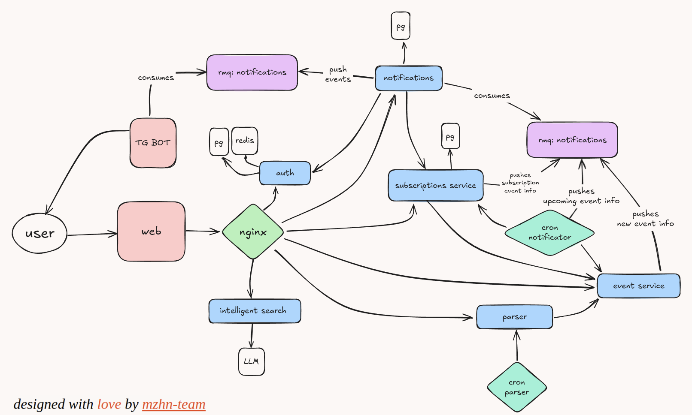

# 🏆 Твой спорт - интерактивный календарь для чемпионов

## Содержание

- [:link: Полезные ссылки](#link-полезные-ссылки)
- [:bulb: Ключевые фишки](#bulb-ключевые-фишки)
- [:green_book: Описание решения](#green_book-описание-решения)
- [:building_construction: Архитектура приложения](#building_construction-архитектура-приложения)
- [:rocket: Запуск проекта](#rocket-запуск-проекта)
- - [Backend](#backend)
- - [Frontend](#frontend)

## :link: Полезные ссылки

- [Демо (Лендинг)](http://mzhn.fun:4000)
- [Демо (Личный кабинет)](http://mzhn.fun:4001)
- [Презентация](https://disk.yandex.ru/i/mRWHgyuBxbFp_g)
- [Скринкаст](https://disk.yandex.ru/i/M_FmPsuSh8eeWA)
- [Видео защиты](https://disk.yandex.ru/i/GurTFsR9okVDeA)

## :bulb: Ключевые фишки

- **Интеллектуальный поиск** и рекомендации соревнований на основе модели ИИ
- Своевременное уведомление о предстоящих мероприятиях в **Telegram**
- **Наглядное представление** данных на календаре с фильтрацией и сортировками
- **Адаптивный интерфейс** для работы на мобильных устройствах
- Отдельная система для подбора мероприятий без необходимости регистрации

## :green_book: Описание решения


Наш проект — это интерактивная платформа для отображения календаря спортивных мероприятий, построенная на основе `микросервисной` архитектуры с использованием языка программирования `Go`. Выбор `Go` обеспечивает высокую производительность, простоту масштабирования и надежность системы.
Сервис для парсинга pdf разработан с использованием `Python`.

В проекте также реализован сервис интеллектуального поиска, разработанный с использованием технологий `LLM` (`LangChain` и `Python`). Этот сервис позволяет находить релевантные данные в системе с помощью модели `LLM`, предоставляя гибкость в решении аналитических задач и обработке пользовательских запросов.

Мы используем `PostgreSQL` для хранения структурированных данных, что позволяет эффективно управлять большим объемом информации. `Redis` интегрирован для кэширования часто запрашиваемых данных, ускоряя доступ к ним, а `RabbitMQ` обеспечивает надёжную и асинхронную обработку задач, таких как отправка уведомлений или обновление расписания.

В качестве прокси-сервера и балансировщика нагрузки используется `Nginx`, который обеспечивает высокую доступность и устойчивость платформы при одновременной обработке большого количества запросов.

Благодаря `микросервисной` архитектуре, каждый компонент системы изолирован и может развиваться независимо, что упрощает поддержку и масштабирование. Такой подход гарантирует быструю обработку запросов пользователей и возможность гибко адаптироваться под новые требования.

Фронтенд платформы разработан с использованием `TypeScript` и фреймворка `Next.js`, что обеспечивает современный, удобный и производительный интерфейс для взаимодействия с пользователями. Благодаря серверному рендерингу и возможностям `Next.js`, пользователи получают быстрый доступ к данным и плавную навигацию по системе. `TypeScript` помогает поддерживать высокое качество кода, снижая вероятность ошибок и улучшая читаемость, что особенно важно для масштабируемых решений. Интуитивно понятный дизайн позволяет спортсменам, тренерам и организаторам легко фильтровать и находить актуальную информацию о спортивных мероприятиях.

## :building_construction: Архитектура приложения



- **web** - **веб-интерфейс**  
  Веб-приложение, предоставляющее пользователю доступ к платформе через браузер. Реализует пользовательский интерфейс для просмотра и фильтрации календаря мероприятий.
- **intellegent search** - **сервис умного поиска**
  Обеспечивает интеллектуальный поиск по мероприятиям
- **auth** - **сервис аутентификации**  
  Обеспечивает регистрацию и авторизацию пользователей, управление их доступом и безопасностью.
- **subscriptions service** - **сервис подписок**  
  Обрабатывает подписки пользователей на мероприятия и отправляет уведомления о них.
- **notifications** - **сервис уведомлений**  
  Отвечает за отправку персонализированных уведомлений пользователям через различные каналы связи (например, Telegram).
- **rmq: notifications** - **очередь уведомлений (RabbitMQ)**  
  Используется для асинхронной обработки задач, связанных с уведомлениями, обеспечивая надежность и масштабируемость.
- **cron notifier** - **уведомляющий крон-скрипт**  
  Запланированный процесс, отвечающий за отправку информации о приближающихся мероприятиях в сервис уведомлений.
- **event service** - **сервис мероприятий**  
  Управляет базой данных мероприятий, предоставляя актуальную информацию для фильтрации и отображения.
- **parser** - **сервис парсинга**  
  Автоматически извлекает информацию о мероприятиях из внешних источников (например, сайта Минспорта) и сохраняет её в систему.
- **cron parser** - **парсер, запускаемый по расписанию**  
  Регулярно обновляет данные о мероприятиях, сканируя новые версии внешних источников.
- **TG BOT** - **Telegram-бот**  
  Взаимодействует с пользователями через Telegram, предоставляя доступ к информации о мероприятиях и отправляя уведомления.
- **nginx** - **Nginx (балансировщик нагрузки)**  
  Используется для маршрутизации запросов между пользователем и микросервисами, а также для кэширования и оптимизации производительности.

## :rocket: Запуск проекта

### Backend

Клонируем репозиторий

```bash
git clone https://github.com/mzhn-fsp-okr/mzhn-fsp-okr.git
```

```bash
cd mzhn-fsp-okr
```

```bash
cd deployment
```

Копируем пример переменных окружения.
Заполняем [необходимые](#wrench-переменные-окружения) значения (по умолчанию все поля кроме AI_SEARCH_GIGACHAT_CREDENTIALS, BOT_TOKEN заполнены)

```bash
cp example.env .env
```

```bash
docker compose up -d --build
```

### Frontend

#### Личный кабинет


Клонируем репозиторий

```bash
git clone https://github.com/mzhn-fsp-okr/mzhn-fsp-okr.git
```

```bash
cd mzhn-fsp-okr
```

```bash
cd frontend-main
```

Копируем пример переменных окружения.
Заполняем [необходимые](#wrench-переменные-окружения) значения (по умолчанию все поля кроме NEXT_PUBLIC_API_URL заполнены)

```bash
cp example.env .env
```

```bash
docker compose up -d --build
```

Приложение будет запущено по адресу `localhost:3000`

#### Лэндинг


Клонируем репозиторий

```bash
git clone https://github.com/mzhn-fsp-okr/mzhn-fsp-okr.git
```

```bash
cd mzhn-fsp-okr
```

```bash
cd frontend-landing
```

Копируем пример переменных окружения.
Заполняем [необходимые](#wrench-переменные-окружения) значения (по умолчанию все поля кроме API_URL заполнены)

```bash
cp example.env .env
```

Собираем и запускаем приложение

```bash
npm i
```

```bash
npm run build
```

```bash
npm run start
```

Приложение будет запущено по адресу `localhost:3000`

> ⚠ Приложение будет конфликтовать с личным кабинетом, так что возможен иной порт для запуска

## :wrench: Переменные окружения

В этом разделе перечислены все необходимые переменные окружения

| Переменная окружения            | Описание (на русском)                          |
| ------------------------------- | ---------------------------------------------- |
| AUTH_SERVICE_HTTP_PORT          | HTTP порт для Auth Service                     |
| AUTH_SERVICE_GRPC_PORT          | gRPC порт для Auth Service                     |
| AUTH_SERVICE_PG_NAME            | Имя базы данных Auth Service                   |
| AUTH_SERVICE_PG_USER            | Пользователь базы данных Auth Service          |
| AUTH_SERVICE_PG_PASS            | Пароль базы данных Auth Service                |
| EVENT_SERVICE_HTTP_PORT         | HTTP порт для Event Service                    |
| EVENT_SERVICE_GRPC_PORT         | gRPC порт для Event Service                    |
| EVENT_SERVICE_PG_NAME           | Имя базы данных Event Service                  |
| EVENT_SERVICE_PG_USER           | Пользователь базы данных Event Service         |
| EVENT_SERVICE_PG_PASS           | Пароль базы данных Event Service               |
| SUBSCRIPTIONS_SERVICE_HTTP_PORT | HTTP порт для Subscriptions Service            |
| SUBSCRIPTIONS_SERVICE_GRPC_PORT | gRPC порт для Subscriptions Service            |
| SUBSCRIPTIONS_SERVICE_PG_NAME   | Имя базы данных Subscriptions Service          |
| SUBSCRIPTIONS_SERVICE_PG_USER   | Пользователь базы данных Subscriptions Service |
| SUBSCRIPTIONS_SERVICE_PG_PASS   | Пароль базы данных Subscriptions Service       |
| NOTIFICATION_SERVICE_HTTP_PORT  | HTTP порт для Notification Service             |
| NOTIFICATION_SERVICE_GRPC_PORT  | gRPC порт для Notification Service             |
| NOTIFICATION_SERVICE_PG_NAME    | Имя базы данных Notification Service           |
| NOTIFICATION_SERVICE_PG_USER    | Пользователь базы данных Notification Service  |
| NOTIFICATION_SERVICE_PG_PASS    | Пароль базы данных Notification Service        |
| JWT_ACCESS_SECRET               | Секретный ключ для создания access токена      |
| JWT_ACCESS_TTL                  | Время жизни access токена (в минутах)          |
| JWT_REFRESH_SECRET              | Секретный ключ для создания refresh токена     |
| JWT_REFRESH_TTL                 | Время жизни refresh токена (в минутах)         |
| BCRYPT_COST                     | Кол-во раундов bcrypt для хеширования паролей  |
| AMQP_PORT                       | Порт RabbitMQ                                  |
| AMQP_USER                       | Пользователь RabbitMQ                          |
| AMQP_PASS                       | Пароль RabbitMQ                                |
| AMQP_NOTIFICATIONS_EXCHANGE     | RabbitMQ exchange для уведомлений              |
| AMQP_NEW_EVENTS_EVENTS_QUEUE    | RabbitMQ очередь для новых событий             |
| AMQP_UPCOMING_EVENTS_QUEUE      | RabbitMQ очередь для предстоящих событий       |
| AMQP_SUBSCRIPTIONS_EXCHANGE     | RabbitMQ exchange для подписок                 |
| AMQP_TELEGRAM_QUEUE             | RabbitMQ очередь для Telegram                  |
| AMQP_MAIL_QUEUE                 | RabbitMQ очередь для электронной почты         |
| AI_SEARCH_GIGACHAT_CREDENTIALS  | Секретный ключ Gigachat                        |
| CRON_INTERVAL_MIN               | Интервал выполнения задач CRON (в минутах)     |
| BOT_TOKEN                       | Токен телеграм бота                            |
| :-----------------------------: | :--------------------------------------------: |
| NEXT_PUBLIC_SELF_URL            | Ссылка на NextJS приложение - на самого себя   |
| NEXT_API_CABINET_URL            | Ссылка в лэндинге на личный кабинет            |
| NEXT_PUBLIC_API_URL             | Ссылка на Backend NGINX API                    |
| API_URL                         | Ссылка на Backend NGINX API                    |


