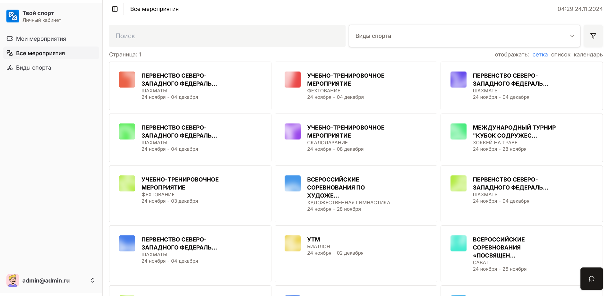

# Frontend "Свой спорт - интерактивный календарь для чемпионов"

Современное web-приложение-календарь для отслеживания спортивных мероприятий



## Ключевые особенности

- Умный поиск и фильтрация на основе ИИ
- Подписка на соревнования в Telegram
- Подробный календарь предстоящих событий

## Стэк технологий

- React
- NextJS
- TailwindCSS
- shadcn/ui
- TypeScript

## Развертывание

### Docker

Приложение поддерживает развертывание с использованием Docker Compose.

### Ручное развертывание

1. Установить необходимые библиотеки

   ```bash
   npm ci
   ```

2. Определить переменные среды (см. .env)
3. Запустить проект

   ```bash
   npm run start
   ```

Приложение будет доступно на порту 3000.

### Переменные среды

- `NEXT_PUBLIC_SELF_URL` - ссылка на публичный адрес этого сайта
- `NEXT_PUBLIC_API_URL` - ссылка на API сервер
